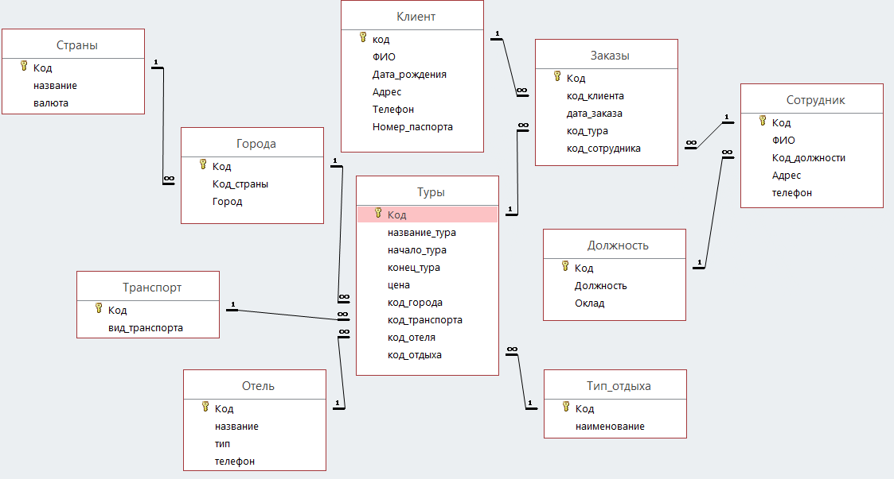
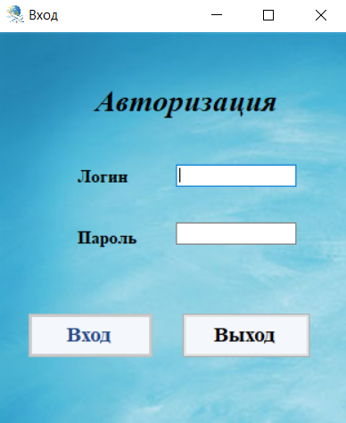
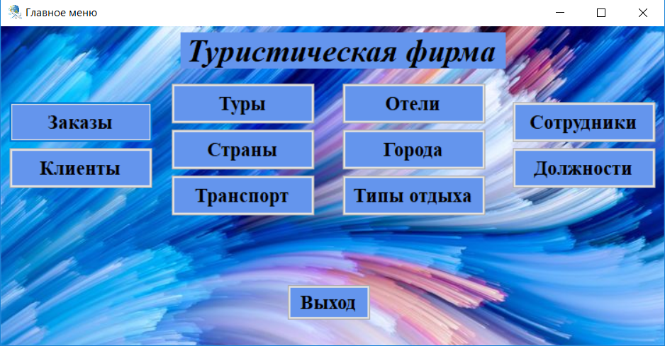
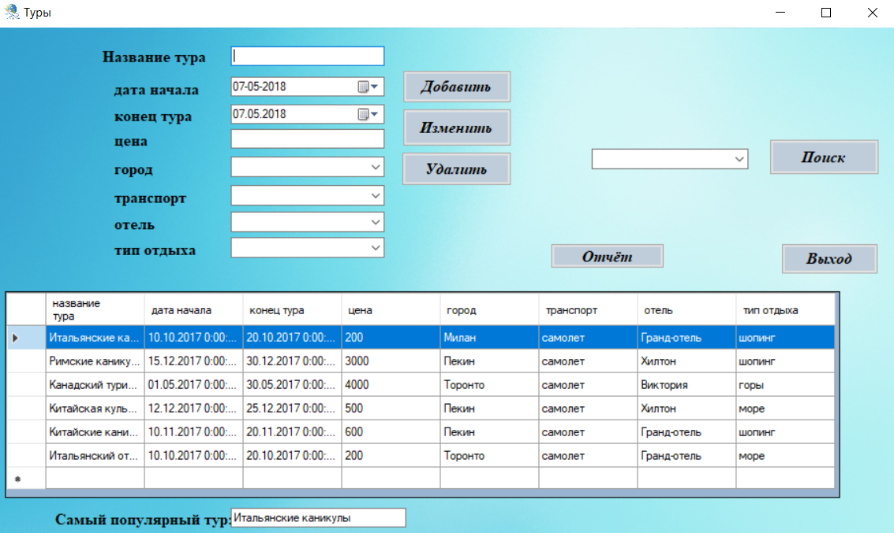
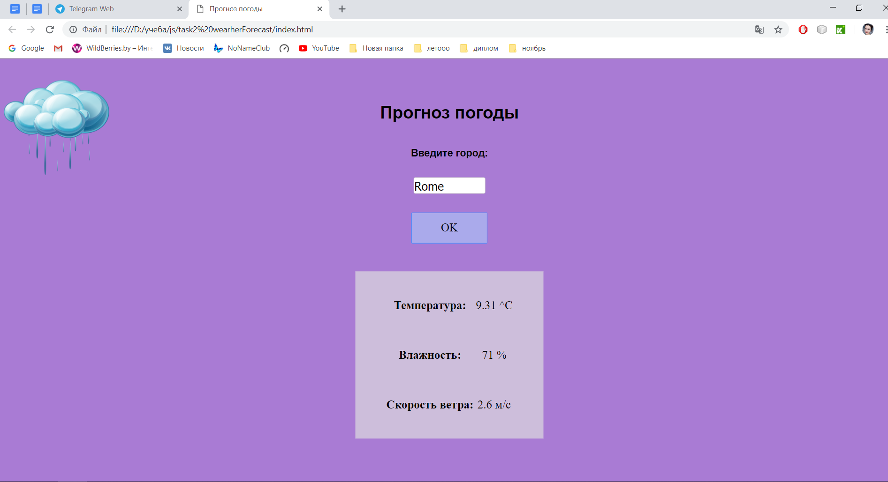
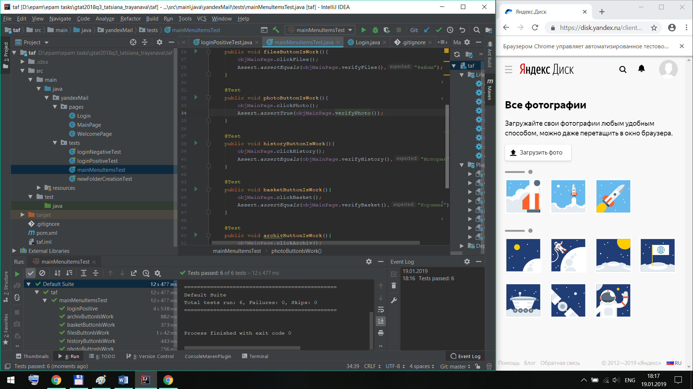

# **Tatsiana Trayanava**

---------------------------------

*email :* tanusha_troyanova@mail.ru     
*tel :*  +375445952292

---------------------------------

*I'm interested in :* front end, web design     
*I want to progress in :* frontend programming      
*Hobbies :* music, cycling, painting.

------------------------------------
## **SKILLS**

- HTML, CSS, JavaScript, Java, SQL, QA 
- Selenium WebDriver, TestNG
- Maven
- IDE - JetBrains WebStorm, Git Github/bitbucket, VisualStudio,MSSQL Experience in writing test documentation, bug reporting, auto tests
- English level (Intermediate)

-------------------------------------
## **EDUCATION**

1. **GOMEL STATE UNIVERSITY FR. SCARYNA**, *Gomel*        
*Sep 2015 – Aug 2019* |Faculty of Mathematics and Technologies of Programming. Software Engineer

2. **ANDERSEN**, *Gomel*    
*Oct 2018  - Dec 2018* | Java Script courses

3. **EPAM SYSTEMS**, *Gomel*  
*Sep 2017 – Dec 2017* | Java courses    
*Nov 2018 - Jan 2019* | QA courses /Automation QA courses

--------------------------------------------
## **Portfolio**

1. **Desctop application for tour firm.**         
The purpose of this project is to develop a database of a travel company, with the ability to edit all tables and obtain information about the activities of the above-mentioned organization. This client-server application is written in the Microsoft Visual Studio 2017 development environment using C# programming language. The database that is used in the application is implemented in MS SQL Server Management Studio.   
### database schema:

### Applicaton:

...

2. **Weather forecast using java script, HTML, CSS.**          
Information about weather this app receive from api [openweathermap](https://openweathermap.org/) in json format.

3. **Experience in writing automation tests for yandex mail:**
